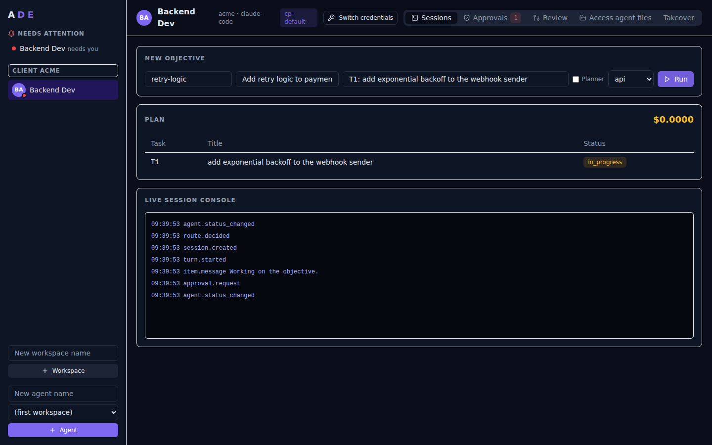
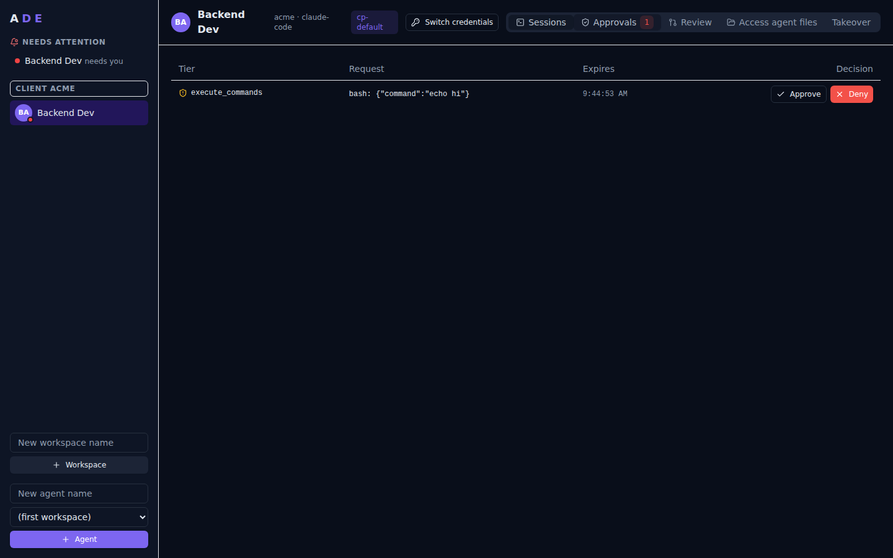
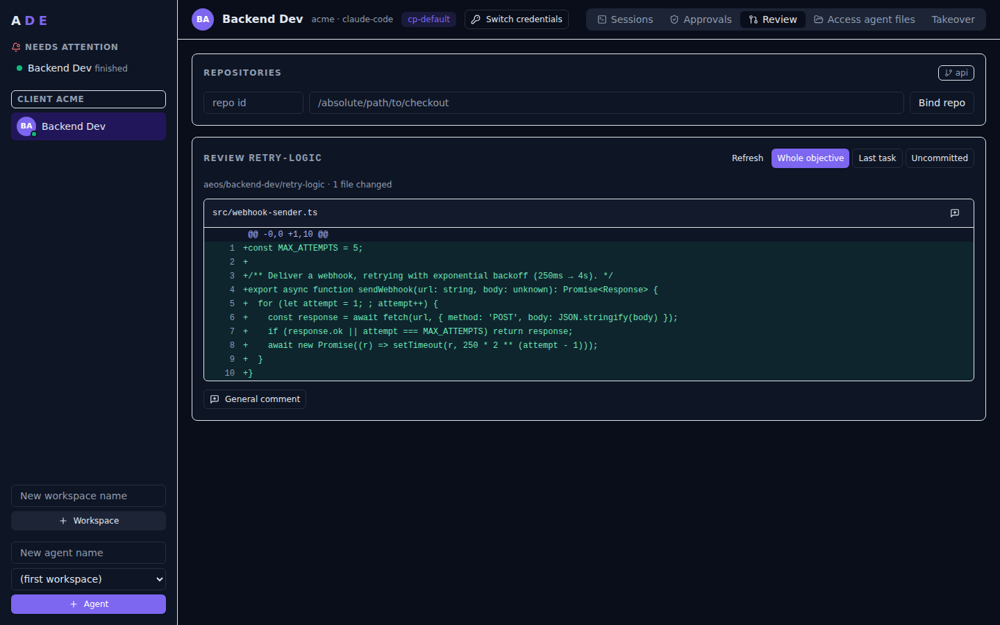

<p align="center">
<pre align="center">
 █████╗ ███████╗ ██████╗ ███████╗
██╔══██╗██╔════╝██╔═══██╗██╔════╝
███████║█████╗  ██║   ██║███████╗
██╔══██║██╔══╝  ██║   ██║╚════██║
██║  ██║███████╗╚██████╔╝███████║
╚═╝  ╚═╝╚══════╝ ╚═════╝ ╚══════╝
     Autonomous Engineering Operating System
</pre>
</p>

<p align="center">
  <strong>The autonomous engineering OS where the agent — not the chat — is the durable object.</strong>
</p>

<p align="center">
  <a href="./docs/ROADMAP.md"></a>
  <a href="https://github.com/mirrorfolio-idea-labs/AEOS/actions/workflows/ci.yml"></a>
  <a href="./docs/pm/BOARD.md"></a>
  <a href="https://www.npmjs.com/package/pnpm"></a>
  <a href="https://nodejs.org/"></a>
  <a href="./LICENSE"></a>
</p>

<p align="center">
  Runtime: <code>aeosd</code> daemon &nbsp;·&nbsp; UI: <code>ADE</code> web/desktop &nbsp;·&nbsp; Built by <a href="https://github.com/mirrorfolio-idea-labs">Mirrorfolio</a>
</p>

<p align="center">
  
</p>

| Approvals inbox | Review the agent's diff, comment by line |
|---|---|
|  |  |

<sub>Screenshots and the terminal recording (<a href="./docs/assets/golden-path.cast"><code>golden-path.cast</code></a>, play with <code>asciinema play</code>) are regenerated by <code>pnpm -F @aeos/docs demo:assets</code>.</sub>

---

## What is this, actually?

AEOS runs AI coding agents — like Claude Code — as *persistent workers*
instead of chat sessions. You give an agent an objective ("fix this bug",
"add this feature"), it breaks that into a checklist, and it works through
the checklist one item at a time. Every time it finishes an item, it saves
its progress to a plain file on disk.

That last part is the whole point: **if the process crashes, your laptop
dies, or you just close it and come back tomorrow, the agent doesn't
forget anything.** You restart it and it keeps going from the exact item
it was on — the same way a build server picks up a job, not the way a
chat app loses context when you refresh the tab. **ADE** is the web
dashboard where you watch this happen: create an agent, hand it a task,
watch its output stream in, browse the files it's written.

Nothing here is magic — it's a small server (`aeosd`) that runs on your
machine (or eventually a remote box), starts Claude Code as a subprocess
for you, and keeps careful records. If you've used a task queue, a CI
runner, or a process supervisor before, the shape will feel familiar.

<details>
<summary><b>The one-sentence version, for people who want it dense</b></summary>
<br>

> An agent is not a conversation. It is a durable object with identity,
> memory, objectives, and a checkpointed plan. Sessions are cheap disposable
> execution contexts that come and go; the *agent* persists. Recovery never
> replays a transcript — it re-enters the plan at the last completed checkpoint
> and keeps working. `kill -9` the daemon; restart; the agent picks up where
> it stopped.

</details>

### The ideas behind it, explained plainly

<table>
<tr><td><b>Your data is just files</b></td><td>Everything the agent knows — its memory, its progress, its plan — is saved as plain text files you can open, read, and back up yourself. There's a small database for fast search, but it's disposable: delete it and the system rebuilds it from the files. Nothing important lives only in a database.</td></tr>
<tr><td><b>Progress, not conversation, is what survives</b></td><td>The unit of work is a checklist item with a checkpoint, not a chat message. Recovering from a crash means "look at the checklist, find the next unchecked item" — never "try to replay everything that was said."</td></tr>
<tr><td><b>Clean environment per agent</b></td><td>Each agent gets its own private config folder — it never touches your personal Claude Code settings, plugins, or history. You explicitly turn features on per-agent if you want them.</td></tr>
<tr><td><b>Run several accounts side by side</b></td><td>If you juggle multiple clients or Claude subscriptions, each agent can be tied to a different login. Four agents, four separate Claude Pro/Max accounts, running at the same time.</td></tr>
<tr><td><b>A big red stop button</b></td><td>One command (<code>aeos stop --all</code>) halts every agent from starting new work — whatever's already running finishes cleanly first, nothing gets killed mid-edit.</td></tr>
</table>

*(If you want the engineering rationale behind these choices, it's all
written down as ADRs in [`docs/adr/`](docs/adr/).)*

None of this was invented in a vacuum. The memory rules above (budgeted
files, no silent truncation, a Curator that archives instead of
deletes) are derived from and credited to
[`NousResearch/hermes-agent`](https://github.com/NousResearch/hermes-agent)
("Hermes") — see [ADR-006](docs/adr/ADR-006-files-as-truth-memory.md).
Full prior-art credits for every borrowed idea are in the architecture
spec.

---

## Quickstart

**Just want to use it?** Download the desktop app or run the one-line
installer: see [Install](docs/getting-started/install.md). The steps below
build AEOS from source.

You'll need **Node.js 22** and **pnpm** (a package manager). If you don't
have pnpm yet, Node ships a tool called `corepack` that installs it for
you — that's the second command below.

```bash
git clone https://github.com/mirrorfolio-idea-labs/AEOS.git
cd AEOS
corepack enable
pnpm install
pnpm build
```

Now start the server. If you have an Anthropic API key
(get one at [console.anthropic.com](https://console.anthropic.com/settings/keys)),
use it — the agent will do real work:

```bash
AEOS_HOME=~/.aeos ANTHROPIC_API_KEY=sk-ant-... node apps/aeosd/dist/main.js run
```

**Don't have a key yet, or just want to look around first?** Leave it off
and add `AEOS_PROVIDER=fake` instead — every agent will "run" against a
scripted stand-in that streams believable-looking output instantly, for
free, so you can click through the whole UI before spending anything:

```bash
AEOS_HOME=~/.aeos AEOS_PROVIDER=fake node apps/aeosd/dist/main.js run
```

Either way, open **http://127.0.0.1:7777** in your browser — create a
workspace, add an agent, give it an objective, and watch it stream. Or
skip the browser and drive it from a terminal instead:

```bash
export AEOS_API_URL=http://127.0.0.1:7777
node apps/cli/dist/main.js workspace create acme --name "Acme Corp"
node apps/cli/dist/main.js agent create dev --workspace acme --name "Dev Agent"
node apps/cli/dist/main.js objective create obj1 --workspace acme --agent dev \
  --title "Fix the flaky test" --task "T1: reproduce and fix"
node apps/cli/dist/main.js objective run obj1 --workspace acme --agent dev
```

**Now try the whole point:** while an objective is running, kill the
server (`Ctrl-C`, or `kill -9` if you want to be dramatic about it) and
run the start command again. The objective picks up exactly where it
stopped — no progress lost, nothing re-explained. That one interruption
and recovery is the entire idea this project exists to prove.

Want to run several Claude subscriptions at once (e.g. one per client)?
See [`packages/provider-claude/README.md`](packages/provider-claude/README.md#multi-account-subscriptions).

**Keep it running, or run it on a server:** `aeos service install` makes it
a login service on Linux/macOS, and `docker compose up -d` runs it in a
container with token auth — see [`docs/deploy.md`](docs/deploy.md) (also:
remote access behind TLS). **Extend it:** third-party providers are npm
plugins — see [`docs/plugins.md`](docs/plugins.md).

---

## System overview

*This section is for people who want to know how it actually works
under the hood — skip it if you just wanted to try the thing above.*

```
┌────────────────────────────────────────────────────────────┐
│  ADE (web UI, React+Tailwind)         CLI (aeos)            │  clients
└──────────────┬─────────────────────────────────────────────┘
               │ HTTP + SSE (OpenAPI 3.1; generated SDK)
┌──────────────▼─────────────────────────────────────────────┐
│  aeosd — kernel daemon                                      │
│  ┌──────────┐ ┌─────────┐ ┌─────────┐ ┌────────────────┐    │
│  │ API       │ │ Scheduler│ │ Event   │ │ State store    │   │
│  │ gateway   │ │ (plan/   │ │ bus     │ │ (files+SQLite  │   │
│  │ (Fastify) │ │ checkpt) │ │         │ │  derived index)│   │
│  └──────────┘ └─────────┘ └─────────┘ └────────────────┘    │
│  ┌────────────────────────┐ ┌───────────────────────────┐   │
│  │ Memory (files + FTS5)  │ │ Provider adapters (Claude, │   │
│  │                        │ │ OpenCode — hermetic)       │   │
│  └────────────────────────┘ └───────────────────────────┘   │
└──────────────┬─────────────────────────────────────────────┘
               │ Unix socket, framed versioned protocol
┌──────────────▼─────────────────────────────────────────────┐
│  Session runners — one supervised process per live session, │
│  survives daemon restarts, re-adopted by session ID          │
└────────────────────────────────────────────────────────────┘
```

**Data flow, one autonomous step:** Objective → plan.md (checklist,
stable task IDs) → Scheduler picks the first incomplete task → provider
adapter spawns the harness in a hermetic profile → NDJSON output
translated into canonical events → event bus → transcript (NDJSON) + SSE
to clients + `costs.ndjson` → task completes → checkpoint written →
scheduler advances. A crash at any point resumes at the same task on
restart — nothing is ever replayed from a transcript.

### Harness adapters

Every adapter is hermetic by default and passes the same conformance
suite. This table is enforced by tests (`packages/provider-core`) — it
cannot drift from the code silently.

<!-- adapters:matrix -->
| Adapter | resume | structuredOutput | mcp | sandbox | costReporting | USD costs |
|---|---|---|---|---|---|---|
| `claude-code` | true | true | true | true | true | usd |
| `codex` | true | true | false | true | true | tokens |
| `opencode` | true | true | true | false | true | usd |
| `fake` | true | true | false | false | true | usd |

**Managed harness binaries.** Pin a harness per agent
(`aeos agent create … --harness-version 0.149.1`) and AEOS runs exactly that
release. It is fetched from the npm registry, checked against the integrity
pinned in `packages/provider-core/src/binaries/pins.ts`, sealed with a tree
hash, and re-verified before it is used. A tampered install is refused, and
a pin never falls back to whatever is on `PATH`. Without a pin, AEOS uses
`--binary-path` (bring your own) and then `PATH`. Capabilities are gated by
version, so asking for a feature that an older pinned release lacks fails
with a typed `capability_version_unsupported` error.

```bash
aeos harness pins                      # releases of record
aeos harness install codex@0.149.1     # fetch + integrity check + seal
aeos harness verify codex@0.149.1      # re-hash against the seal
```

**Repositories and worktrees.** Agents never edit your checkout. Bind a
repository and every objective that targets it gets its own git worktree
under the agent's directory, on branch `aeos/<agent>/<objective>`. Each task
the agent completes becomes one commit authored by that agent. Review the
work in the ADE's Review tab or from the CLI, and send line comments back
to the agent as a follow-up task.

```bash
aeos repo bind app --workspace ws --agent dev --path ~/code/app
aeos objective create feat-x --workspace ws --agent dev --repo app \
  --title "Add export" --done "CSV export works with tests" --task "T1: implement" --task "T2: tests"
aeos objective run feat-x --workspace ws --agent dev
aeos objective diff feat-x --workspace ws --agent dev --scope branch
aeos objective review feat-x --workspace ws --agent dev --comment "src/export.ts:40: handle empty rows"
```

**Who needs you (agent runtime).** Every agent has a live attention status:
`working`, `blocked` (an approval, a budget stop, or a permission prompt on a
takeover screen), `done` or `idle`. The ADE sidebar orders agents by
attention (blocked first, then finished-but-unseen), and you can mark items
seen or unread, or settle them. Scripts can wait on an agent without racing
it. To get a push to your phone, drop a `notifications.yaml` in `AEOS_HOME`.
Screen-state detection uses [herdr](https://github.com/herdrdev/herdr)'s
detection manifests (Apache-2.0, see `THIRD_PARTY_NOTICES.md`).

```bash
aeos inbox                                         # ! blocked  * finished-unseen  ~ working
aeos agent wait dev --workspace ws --until blocked,done --timeout-ms 600000
printf 'webhooks:\n  - url: https://ntfy.sh/my-aeos\n    format: ntfy\n' > ~/.aeos/notifications.yaml
```

**Desktop app.** `apps/desktop` is a thin Tauri 2 shell. It starts `aeosd`
if the daemon isn't already running and opens the ADE. Native notifications
appear when an agent needs you, and clicking one opens that agent's
approvals. `aeos://agent/<workspace>/<agent>/approvals` links work too. The
`desktop` CI workflow builds Linux (deb, AppImage) and macOS (dmg)
installers.

On **Arch Linux**, build the native package instead of using the AppImage.
It compiles against Arch's own WebKitGTK and installs the desktop app,
`aeosd` and `aeos`, plus the `aeos://` link handler:

```bash
git clone https://github.com/mirrorfolio-idea-labs/AEOS && cd AEOS/packaging/arch
makepkg -si
```

CI builds, installs and smoke-tests this package in a clean Arch container
on every desktop change. On NVIDIA's proprietary driver the app turns off
WebKit's DMA-BUF renderer, which otherwise shows a blank window. To override
that, set `WEBKIT_DISABLE_DMABUF_RENDERER` yourself.

---

## Repository

If you're contributing code, here's the map. It's a monorepo (one Git repo,
many packages) managed with pnpm. `packages/contracts` defines every shared
data shape (what an "agent" looks like, what an "event" looks like); every
other package builds on top of it instead of inventing its own.

```
aeos/
├── packages/
│   ├── contracts/           # Zod schemas → JSON Schemas; event envelope; protocol + plugin ABI versions
│   ├── kernel/              # AEOS_HOME layout, registry, event bus, SQLite derived index, audit
│   ├── runner/              # session-runner process + supervisor + framed protocol (unix / TLS-PSK TCP), PTY, sandbox
│   ├── policy/              # tiered policy, layered YAML, budgets, co-edit guard
│   ├── secrets/             # age-encrypted secret store, policy-gated injection, redaction
│   ├── provider-core/       # HarnessAdapter contract + conformance suite + provider-fake + managed binaries
│   ├── provider-claude/     # Claude Code hermetic adapter (BYOK, multi-account slots)
│   ├── provider-opencode/   # OpenCode hermetic adapter
│   ├── provider-codex/      # Codex hermetic adapter
│   ├── plugins/             # third-party plugin host (manifest + ABI gate, out-of-process)
│   ├── router/              # cost-aware model router (pricing index, class routing)
│   ├── memory/              # file memory (budgeted) + frozen snapshots + FTS5 search + curator
│   ├── scheduler/           # plans, checkpoints, verify tasks, retrospectives, jobs, delegation
│   ├── api/                 # Fastify server, OpenAPI 3.1, SSE, token gate, kill switch
│   ├── sdk/                 # generated TS client + SSE reader from the OpenAPI spec
│   └── create-aeos-plugin/  # `npx create-aeos-plugin` scaffolder
├── apps/
│   ├── aeosd/               # daemon composition root (the `aeosd` binary)
│   ├── ade/                 # web UI (React + Vite + Tailwind, shadcn conventions)
│   ├── cli/                 # `aeos` CLI (thin SDK client)
│   ├── desktop/             # Tauri 2 desktop shell
│   └── docs/                # Starlight docs site, rendered from docs/
├── deploy/helm/             # Helm chart
├── docker/                  # daemon image, sandbox runner image, compose smoke test
├── packaging/arch/          # Arch Linux PKGBUILD (desktop app + daemon + CLI)
├── scripts/release/         # bundles, upgrade test, TLS verification
└── docs/                    # specs, plans, ADRs, ROADMAP, PM board, reference
```

---

## Status

**Short version: phases P1 to P4 are complete and released, and v1.0 is
in release candidates.** The crash-and-resume behavior described above was
the first phase ("P1 — Spine"). Everything since then builds on it.

| Phase | Release | What it added |
|---|---|---|
| P1 Spine | `v0.1.0` | Durable agents as files, crash-safe runner, Claude Code + OpenCode harnesses, API, SSE, SDK, CLI, web UI |
| P2 Safety + polish | `v0.2.0` | Tiered policy and approvals inbox, budgets, audit, secrets, PTY takeover, Codex harness, managed binaries, worktrees and review, agent runtime (status, wait, inbox, push), desktop app |
| P3 Autonomy | `v0.3.0` | Classed planner, cost-aware model router, verification gates, retrospective learning loop, durable schedules, delegation |
| P4 Scale + community | `v0.4.0` | Container sandbox tier, public plugin API, service/compose/Helm deploys, TLS-PSK TCP runners, Arch Linux package |
| P5 v1.0 public release | `v1.0.0-rc.*` | OSS readiness, docs site, signed CI releases with SBOMs, public repo and triage; next: public site, one-line install, desktop downloads |

Two checks are still manual sign-offs: the live Claude Code and OpenCode
smokes (P1.M4, P1.M10) and the service reboot test (P4.M3.T1). The
automated suite is green either way.

What's left before `v1.0.0` is tracked in [`docs/ROADMAP.md`](docs/ROADMAP.md)
(the P5 section) and on the [board](docs/pm/BOARD.md). [Open
issues](https://github.com/mirrorfolio-idea-labs/AEOS/issues) labelled
`good first issue` are ready to pick up.

---

## Build, test, run

Node 22, pnpm 9, ESM, strict TypeScript, Vitest, Playwright.

```bash
pnpm install
pnpm build
pnpm test          # workspace-wide vitest
pnpm typecheck
pnpm depcruise     # package-boundary enforcement
```

CI-identical chain:

```bash
pnpm install --frozen-lockfile && pnpm build && pnpm typecheck && pnpm test && pnpm depcruise
```

Regenerate committed generated artifacts after touching their sources
(both are drift-tested in CI):

```bash
pnpm -F @aeos/contracts gen:schemas    # after editing packages/contracts
pnpm -F @aeos/api gen:openapi          # after editing packages/api routes
```

Run the ADE UI's Playwright suite:

```bash
pnpm -F @aeos/ade exec playwright install chromium
pnpm -F @aeos/ade test
```

---

## Read first

| Doc | What's there |
|-----|--------------|
| [`CONTRIBUTING.md`](CONTRIBUTING.md) | How to pick up an issue and ship a PR |
| [`docs/pm/BOARD.md`](docs/pm/BOARD.md) | Current status, active sprint, drift register |
| [`docs/ROADMAP.md`](docs/ROADMAP.md) | The drift anchor — stable task IDs, accept criteria |
| [`docs/PROJECT-CONTEXT.md`](docs/PROJECT-CONTEXT.md) | Single-file cold-start onboarding |
| [`docs/superpowers/specs/2026-07-12-aeos-architecture-design.md`](docs/superpowers/specs/2026-07-12-aeos-architecture-design.md) | Full architecture design |
| [`docs/adr/`](docs/adr/) | Architecture decision records |
| [`docs/reference/cli.md`](docs/reference/cli.md) · [`docs/reference/api.md`](docs/reference/api.md) | Every CLI command and API endpoint (generated, drift-tested) |

---

## Conventions

- **Conventional commits.** Every commit advancing a build task ends its
  subject with the stable task ID: `feat(contracts): event envelope [AEOS-P1.M1.T2]`.
- The commit that completes a task flips its ROADMAP checkbox in the same
  commit.
- **Milestone plans are just-in-time** — written only after the previous
  milestone's exit gate passes, never speculatively.
- **No cross-package internal imports** — packages talk through published
  entry points (`@aeos/x`), never relative paths into `src/`.
- **Facts are the code.** Docs describe intent; code and git history are the
  facts. On any inconsistency, trust the code, fix the doc, log the drift.

## Contributing

Issues are labeled and milestone-tagged; `good first issue` +
`help wanted` mark self-contained entry points. See
[CONTRIBUTING.md](CONTRIBUTING.md) for the full workflow.

## License

[MIT](LICENSE) — see [ADR-001](docs/adr/ADR-001-license-mit.md) for the
rationale.

---

> AEOS is built by Mirrorfolio. It is in v1.0 release candidates: four
> phases are released, and every claim above is backed by a test in CI.
> Watch the [BOARD](docs/pm/BOARD.md), not the hype.
